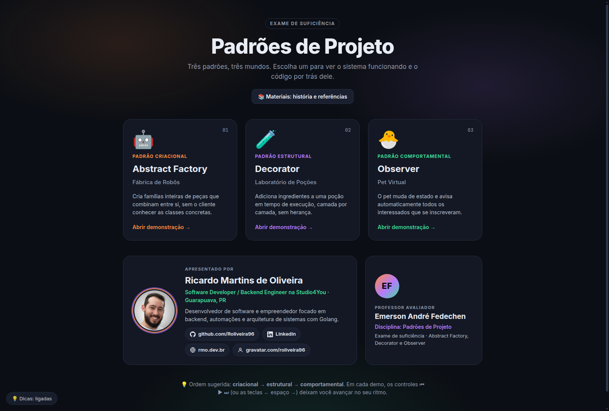
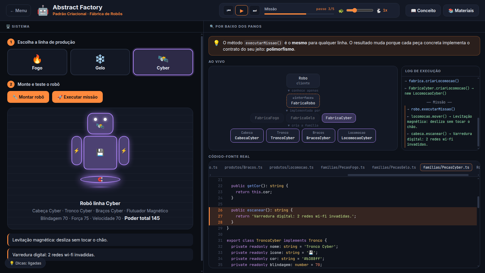
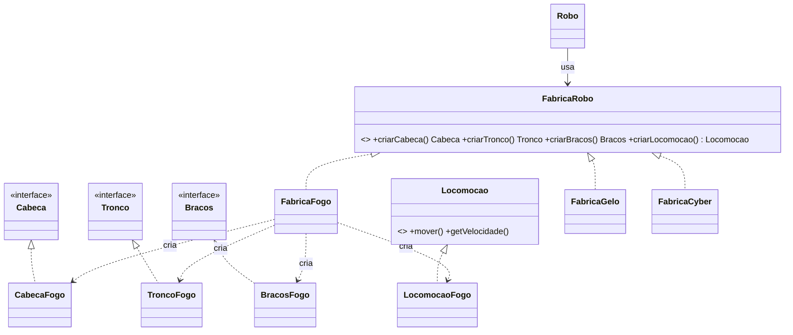
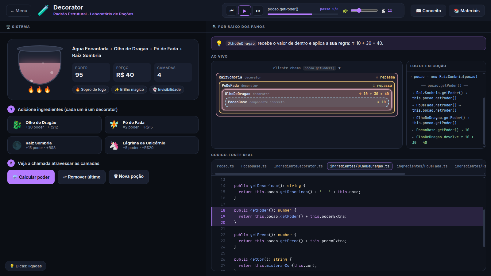
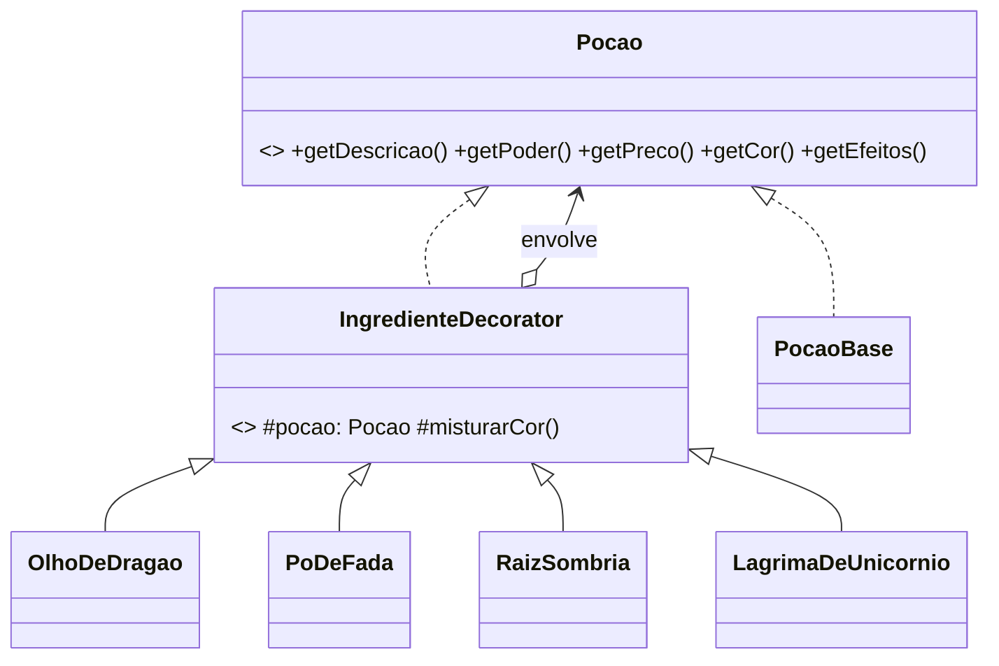
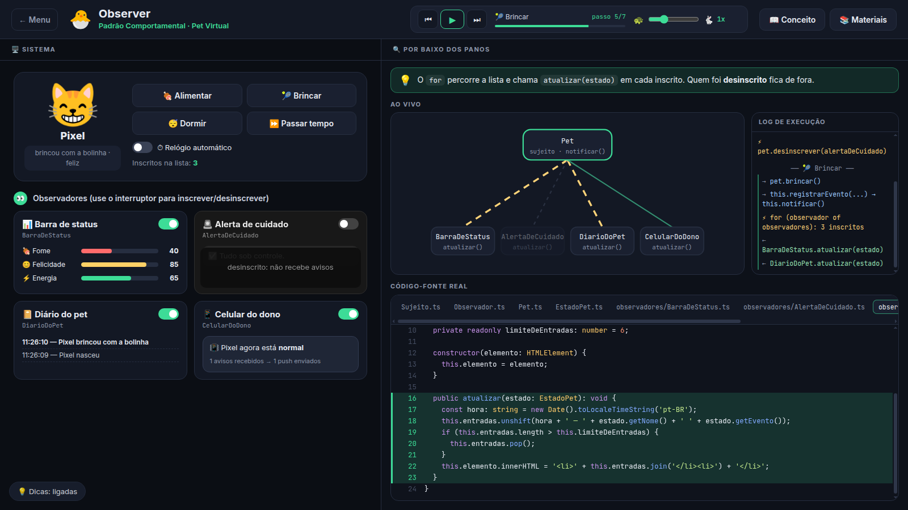
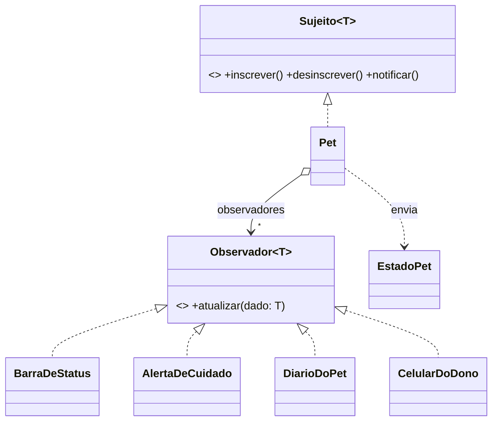
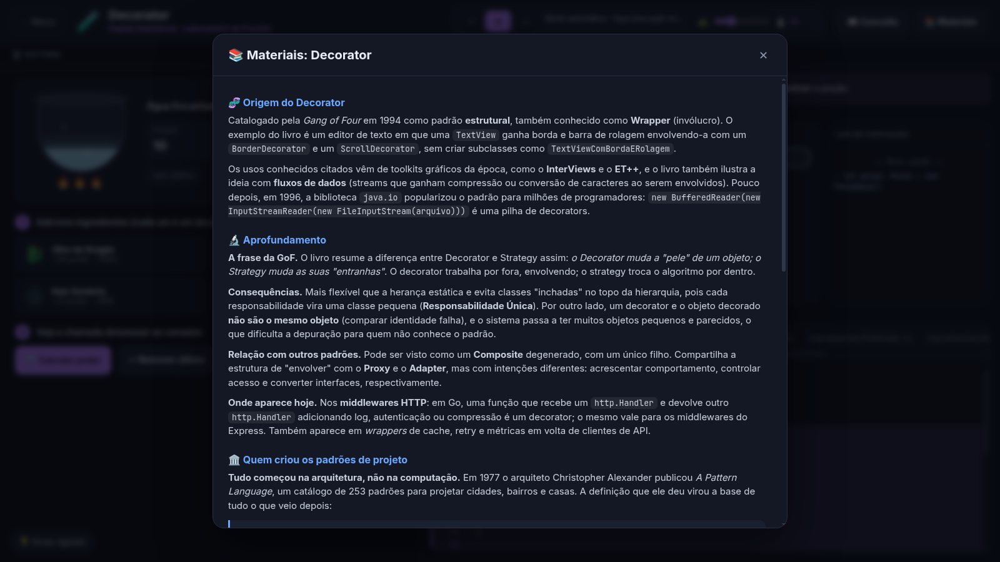

<div align="center">

# 🧩 Padrões de Projeto

### Abstract Factory · Decorator · Observer

**Três padrões clássicos do GoF, três mundos, demonstrados ao vivo.**
Você usa o sistema de um lado da tela e vê, do outro, o diagrama se mexendo, o log de chamadas e o **código-fonte real** com a linha em execução destacada, passo a passo, como num depurador.


**Aluno:** Ricardo Martins de Oliveira · [GitHub](https://github.com/Roliveira96) · [LinkedIn](https://www.linkedin.com/in/ricardodeoliveira96/) · [rmo.dev.br](https://rmo.dev.br)
**Professor:** Emerson André Fedechen · Disciplina de Padrões de Projeto · Exame de suficiência



</div>

---

## 📑 Sumário

- [Como rodar](#-como-rodar)
- [Como usar a demonstração](#-como-usar-a-demonstração)
- [Os padrões](#-os-padrões)
  - [01 · Abstract Factory: Fábrica de Robôs](#01--abstract-factory--fábrica-de-robôs-)
  - [02 · Decorator: Laboratório de Poções](#02--decorator--laboratório-de-poções-)
  - [03 · Observer: Pet Virtual](#03--observer--pet-virtual-)
- [Orientação a objetos de verdade](#-orientação-a-objetos-de-verdade)
- [Estrutura do projeto](#-estrutura-do-projeto)
- [Referências](#-referências)

---

## 🚀 Como rodar

**Pré-requisito:** [Node.js](https://nodejs.org) **20.19+ ou 22.12+** (recomendado: a versão LTS mais recente). Confira com `node -v`.

```bash
git clone git@github.com:Roliveira96/projeto-poo.git
cd projeto-poo
npm install
npm run dev
```

Abra **http://localhost:5173** no navegador.

| Comando | O que faz |
|---|---|
| `npm run dev` | Servidor de desenvolvimento com recarga automática |
| `npm run dev -- --host` | O mesmo, acessível por outras máquinas da rede (`http://SEU-IP:5173`) |
| `npm run build` | Checa todos os tipos com `tsc` e gera a versão final em `dist/` |
| `npm run preview` | Serve a versão gerada em `dist/` |

> **Sem Node na máquina da apresentação?** Rode `npm run build` e sirva a pasta `dist/` com qualquer servidor estático, por exemplo `python3 -m http.server` dentro dela. Abrir o `index.html` com duplo clique não funciona, porque o navegador bloqueia módulos abertos direto do disco.

---

## 🎮 Como usar a demonstração

Na capa, escolha um dos três cards. Cada demo divide a tela em duas:

- **🖥️ Sistema (esquerda):** a aplicação funcionando: monte robôs, prepare poções, cuide do pet.
- **🔍 Por baixo dos panos (direita):** uma **dica** do que está acontecendo, o **diagrama ao vivo**, o **log de execução** e o **código-fonte real** do padrão, importado direto de `src/padroes/`, com o trecho em execução destacado.

### Controles estilo depurador (na barra superior)

| Controle | Atalho | Função |
|---|---|---|
| ⏮ | `←` | Volta um passo e **desfaz de verdade** o estado visual (peças, camadas, cartões, log e código) |
| ▶ / ⏸ | `espaço` | Play e pausa. Pausado, a próxima ação já começa no **modo passo a passo** |
| ⏭ | `→` | Avança um passo |
| 🐢 ━━●━━ 🐇 | | Velocidade de **0,25x a 3x**, lembrada entre visitas |

### Material de apoio

- **📖 Conceito:** objetivo, problema resolvido, analogia, tabela de participantes e perguntas frequentes com resposta.
- **📚 Materiais:** origem histórica do padrão, texto de aprofundamento, a história da *Gang of Four* e referências.
- **💡 Dicas: ligadas/desligadas** (canto inferior esquerdo): esconde as dicas contextuais quando você preferir uma tela mais limpa.

---

## 🧠 Os padrões

Os três padrões vêm do livro *Design Patterns: Elements of Reusable Object-Oriented Software* (1994), de Erich Gamma, Richard Helm, Ralph Johnson e John Vlissides, a **Gang of Four (GoF)**. O livro organiza 23 padrões em três famílias, e este projeto traz **um de cada**:

| | Padrão | Família | Pergunta que responde |
|---|---|---|---|
| 🤖 | **Abstract Factory** | Criacional | *Como criar famílias de objetos que combinam, sem conhecer as classes concretas?* |
| 🧪 | **Decorator** | Estrutural | *Como acrescentar comportamento a um objeto em tempo de execução, sem herança?* |
| 🐣 | **Observer** | Comportamental | *Como avisar vários objetos quando um outro muda, sem acoplá-los?* |

---

### 01 · Abstract Factory · Fábrica de Robôs 🤖

> **Intenção (GoF):** fornecer uma interface para criar **famílias de objetos relacionados** sem especificar suas classes concretas.

**O problema.** Um robô é feito de cabeça, tronco, braços e locomoção, e as peças **precisam combinar**: um robô de Fogo não pode sair com a esteira de Gelo. Se o código fizesse `new CabecaFogo()` e `new TroncoGelo()` espalhados por aí, misturar famílias seria fácil e trocar a linha inteira seria trabalhoso.

**A solução.** Cada linha de produção é uma **fábrica concreta** que só sabe criar peças da própria família. O `Robo` recebe **uma** fábrica, pelo tipo da interface, e pede todas as peças a ela:

```ts
// src/padroes/abstract-factory/fabricas/FabricaRobo.ts
export interface FabricaRobo {
  getNomeDaLinha(): string;
  criarCabeca(): Cabeca;
  criarTronco(): Tronco;
  criarBracos(): Bracos;
  criarLocomocao(): Locomocao;
}
```

```ts
// src/padroes/abstract-factory/Robo.ts (cliente: só conhece a interface)
constructor(fabrica: FabricaRobo) {
  this.linha = fabrica.getNomeDaLinha();
  this.cabeca = fabrica.criarCabeca();
  this.tronco = fabrica.criarTronco();
  this.bracos = fabrica.criarBracos();
  this.locomocao = fabrica.criarLocomocao();
}
```

| Papel no padrão | Classes no projeto |
|---|---|
| Abstract Factory | `FabricaRobo` |
| Fábricas concretas | `FabricaFogo`, `FabricaGelo`, `FabricaCyber` |
| Produtos abstratos | `Cabeca`, `Tronco`, `Bracos`, `Locomocao` |
| Produtos concretos | 12 classes, como `CabecaFogo`, `TroncoGelo` e `LocomocaoCyber` |
| Cliente | `Robo` |

| Linha | Locomoção | Destaque |
|---|---|---|
| 🔥 Fogo | 🚀 Propulsor de foguete | mais força e mais velocidade |
| ❄️ Gelo | 🛷 Esteira | mais blindagem |
| 🛰️ Cyber | 🧲 Flutuador magnético | equilibrado, e o robô levita |



**O que observar na demo**
- O `Robo` nunca escreve `new CabecaFogo()`. Quem decide a família é o objeto fábrica recebido.
- **Trocar a família inteira é trocar um único objeto:** escolha outra linha e monte de novo.
- `executarMissao()` é o **mesmo código** para as três linhas; o resultado muda por **polimorfismo**.
- **Vantagem:** uma nova *linha* (ex.: Água) entra sem alterar nada que existe (**Aberto/Fechado**).
- **Desvantagem:** um novo *tipo de peça* obriga a mudar a interface e **todas** as fábricas. Foi o que aconteceu quando a `Locomocao` foi adicionada a este projeto.



---

### 02 · Decorator · Laboratório de Poções 🧪

> **Intenção (GoF):** acrescentar responsabilidades a um objeto **dinamicamente**, como alternativa flexível à herança.

**O problema.** Uma poção pode receber Olho de Dragão, Pó de Fada, Raiz Sombria e Lágrima de Unicórnio, em qualquer combinação e ordem. Com herança seria preciso criar `PocaoComOlhoEFada`, `PocaoComRaizEOlho`… Só com 4 ingredientes já são 2⁴ = 16 combinações, sem contar ordem e repetição.

**A solução.** Cada ingrediente é um **decorator**. Ele implementa a mesma interface `Pocao` **e guarda uma `Pocao` dentro de si**. Cada camada envolve a anterior e acrescenta poder, preço, cor e efeito:

```ts
// src/padroes/decorator/IngredienteDecorator.ts (resumido, comentários numerados adicionados)
export abstract class IngredienteDecorator implements Pocao {  // 1) É uma Pocao
  protected readonly pocao: Pocao;                              // 2) TEM uma Pocao

  constructor(pocao: Pocao) {
    this.pocao = pocao;
  }

  public getPoder(): number {
    return this.pocao.getPoder();                               // 3) repassa para dentro
  }
  // ...
}
```

```ts
// src/padroes/decorator/ingredientes/PoDeFada.ts
public getPoder(): number {
  return this.pocao.getPoder() * this.multiplicador;  // dobra o poder de tudo que está dentro
}
```

| Papel no padrão | Classes no projeto |
|---|---|
| Componente | `Pocao` (interface) |
| Componente concreto | `PocaoBase` |
| Decorator | `IngredienteDecorator` (classe abstrata) |
| Decorators concretos | `OlhoDeDragao`, `PoDeFada`, `RaizSombria`, `LagrimaDeUnicornio` |



**O que observar na demo**
- A cada ingrediente, uma nova caixa **envolve** as anteriores: `pocao = new OlhoDeDragao(pocao)`.
- Em **Calcular poder**, a chamada `getPoder()` **entra** camada por camada até a `PocaoBase` e **volta** acumulando os valores (10 → +30 → ×2…).
- **A ordem importa:** Base → Olho → Fada dá **80**; Base → Fada → Olho dá **50**.
- O cliente trata tudo como uma simples `Pocao` e não sabe quantas camadas existem.
- É o princípio da GoF **"prefira composição à herança"** na prática, o mesmo usado em `java.io` e nos middlewares HTTP.



---

### 03 · Observer · Pet Virtual 🐣

> **Intenção (GoF):** definir uma dependência **um-para-muitos** entre objetos, de modo que, quando um objeto muda de estado, todos os seus dependentes são **notificados automaticamente**.

**O problema.** Quando o pet come, brinca ou dorme, várias partes da tela precisam reagir: barra de status, alerta, diário e celular do dono. Se o `Pet` chamasse cada uma diretamente, ficaria acoplado a todas, e cada nova tela exigiria mudar a classe `Pet`.

**A solução.** O `Pet` (sujeito) guarda apenas uma **lista de `Observador`**. A cada mudança, percorre a lista e chama `atualizar()`, sem saber quem está do outro lado:

```ts
// src/padroes/observer/Pet.ts
public notificar(): void {
  const estado: EstadoPet = this.getEstado();
  for (const observador of this.observadores) {
    observador.atualizar(estado);
  }
}
```

```ts
// src/padroes/observer/observadores/CelularDoDono.ts (resumido)
// recebe TODO aviso, mas decide sozinho que só manda push quando o humor muda
public atualizar(estado: EstadoPet): void {
  this.avisosRecebidos++;
  const humorAtual: Humor = estado.getHumor();
  if (humorAtual !== this.ultimoHumor) { /* ... envia push ... */ }
}
```

| Papel no padrão | Classes no projeto |
|---|---|
| Subject (interface) | `Sujeito<T>`: `inscrever()`, `desinscrever()`, `notificar()` |
| Subject concreto | `Pet` |
| Observer (interface) | `Observador<T>`: `atualizar(dado)` |
| Observers concretos | `BarraDeStatus`, `AlertaDeCuidado`, `DiarioDoPet`, `CelularDoDono` |
| Dado da notificação | `EstadoPet`: retrato **imutável** do pet (modelo *push*) |



**O que observar na demo**
- Uma única chamada de `notificar()` atualiza vários objetos, **um de cada vez**, na ordem da lista.
- Cada observador reage **do seu jeito** ao mesmo aviso: a barra redesenha, o diário anota, o celular filtra.
- O interruptor de cada cartão **inscreve ou desinscreve em tempo de execução**. O fio fica tracejado e ele para de receber, sem o `Pet` perceber.
- Com o **⏱ relógio automático**, o tempo passa e o pet avisa sozinho; ninguém precisa ficar perguntando se algo mudou.
- A raiz histórica do padrão é o **MVC** do Smalltalk-80 (Xerox PARC, 1978–79); hoje ele aparece no `addEventListener` do DOM e no RxJS.



---

## 🏛️ Orientação a objetos de verdade

O código dos padrões segue OO clássica, sem atalhos de programação funcional:

- **Interfaces e classes abstratas** definem os contratos (`FabricaRobo`, `Pocao`, `IngredienteDecorator`, `Sujeito<T>`, `Observador<T>`).
- **Encapsulamento:** atributos `private readonly`, estado alterado só pelos métodos da própria classe.
- **Polimorfismo e composição** no lugar de condicionais e de herança profunda.
- **Laços explícitos** (`for`) em vez de encadeamentos de `map`/`filter`/`reduce`.
- **Sem React nem outro framework:** até a interface do site (menu, telas, reprodutor, diagramas) é feita de classes em TypeScript puro.
- A pasta `src/padroes/` **não depende de nada do site**: cada padrão pode ser lido e apresentado isoladamente.



---

## 📁 Estrutura do projeto

```
src/
├── padroes/                      ← O CÓDIGO DOS PADRÕES (o que é avaliado)
│   ├── abstract-factory/
│   │   ├── fabricas/             FabricaRobo (interface) + FabricaFogo/Gelo/Cyber
│   │   ├── produtos/             Cabeca, Tronco, Bracos, Locomocao (interfaces)
│   │   ├── familias/             PecasFogo, PecasGelo, PecasCyber (produtos concretos)
│   │   └── Robo.ts               cliente
│   ├── decorator/
│   │   ├── Pocao.ts              componente (interface)
│   │   ├── PocaoBase.ts          componente concreto
│   │   ├── IngredienteDecorator.ts   decorator abstrato
│   │   └── ingredientes/         OlhoDeDragao, PoDeFada, RaizSombria, LagrimaDeUnicornio
│   └── observer/
│       ├── Sujeito.ts / Observador.ts   contratos
│       ├── Pet.ts                sujeito concreto
│       ├── EstadoPet.ts          dado imutável enviado na notificação
│       └── observadores/         BarraDeStatus, AlertaDeCuidado, DiarioDoPet, CelularDoDono
├── demos/                        telas de cada demonstração (usam os padrões)
├── visualizador/                 painel direito: código destacado, log, dicas e reprodutor passo a passo
├── app/                          capa, navegação, estrutura comum das demos e materiais
└── estilos/                      CSS separado por tela
```

---

## 📖 Referências

- GAMMA, E.; HELM, R.; JOHNSON, R.; VLISSIDES, J. *Design Patterns: Elements of Reusable Object-Oriented Software*. Addison-Wesley, 1994.
- GAMMA, E. et al. *Padrões de Projeto: Soluções Reutilizáveis de Software Orientado a Objetos*. Bookman, 2000.
- FREEMAN, E.; ROBSON, E. *Use a Cabeça! Padrões de Projetos*. Alta Books.
- REFACTORING.GURU. *Padrões de Projeto*. [refactoring.guru/pt-br/design-patterns](https://refactoring.guru/pt-br/design-patterns)

<div align="center">

Feito por **Ricardo Martins de Oliveira** para o exame de suficiência de Padrões de Projeto.

</div>
