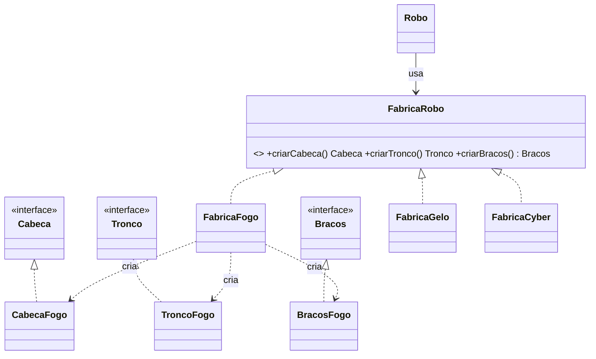
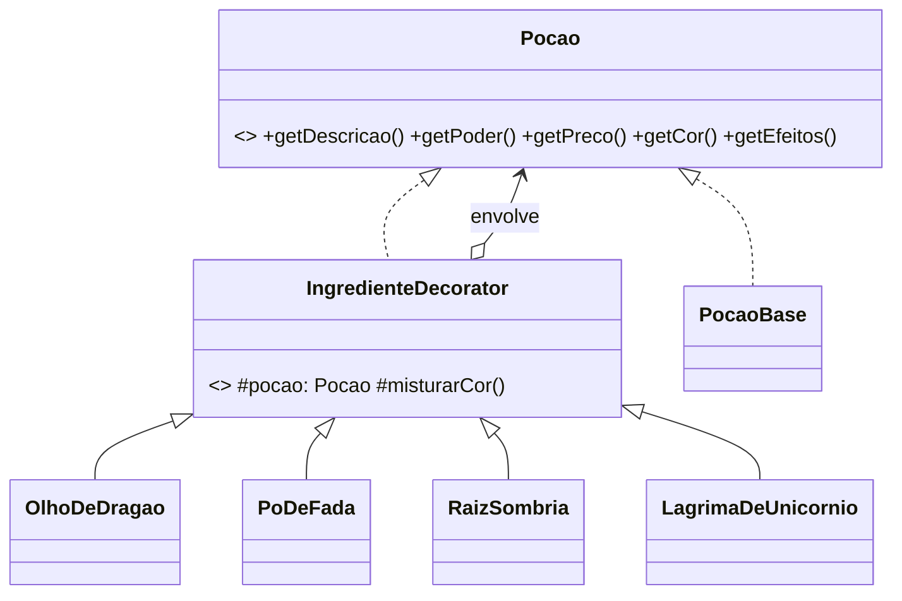
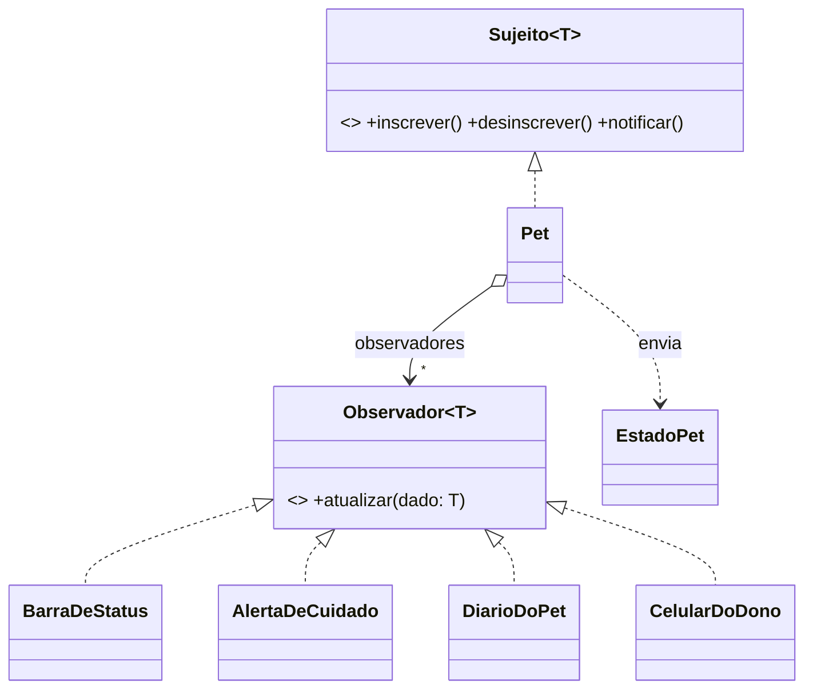

# Padrões de Projeto: Exame de Suficiência

**Ricardo Martins de Oliveira** · [github.com/Roliveira96](https://github.com/Roliveira96) · [rmo.dev.br](https://rmo.dev.br)

Implementação de três padrões do GoF em **TypeScript orientado a objetos**, cada um com um tema próprio
e uma demonstração interativa com tela dividida: **o sistema funcionando** de um lado e
**o que acontece por baixo dos panos** do outro (diagrama ao vivo, log de chamadas e o código-fonte real com a linha em execução destacada).

| # | Padrão | Categoria | Tema |
|---|--------|-----------|------|
| 01 | Abstract Factory | Criacional | 🤖 Fábrica de Robôs |
| 02 | Decorator | Estrutural | 🧪 Laboratório de Poções |
| 03 | Observer | Comportamental | 🐣 Pet Virtual |

## Como rodar

```bash
npm install
npm run dev      # abre em http://localhost:5173
npm run build    # checa os tipos (tsc) e gera a versão final em dist/
```

## Onde está cada coisa

```
src/
├── padroes/                  ← O CÓDIGO DOS PADRÕES (o que é avaliado)
│   ├── abstract-factory/
│   │   ├── fabricas/         FabricaRobo (interface) + FabricaFogo/Gelo/Cyber
│   │   ├── produtos/         Cabeca, Tronco, Bracos (interfaces)
│   │   ├── familias/         PecasFogo, PecasGelo, PecasCyber (produtos concretos)
│   │   └── Robo.ts           cliente
│   ├── decorator/
│   │   ├── Pocao.ts          componente (interface)
│   │   ├── PocaoBase.ts      componente concreto
│   │   ├── IngredienteDecorator.ts   decorator abstrato
│   │   └── ingredientes/     OlhoDeDragao, PoDeFada, RaizSombria, LagrimaDeUnicornio
│   └── observer/
│       ├── Sujeito.ts / Observador.ts   contratos
│       ├── Pet.ts            sujeito concreto
│       ├── EstadoPet.ts      dado imutável enviado na notificação
│       └── observadores/     BarraDeStatus, AlertaDeCuidado, DiarioDoPet, CelularDoDono
├── demos/                    telas de cada demonstração (usam os padrões)
├── visualizador/             painel direito: código com destaque, log e dicas
├── app/                      menu, navegação e estrutura comum das demos
└── estilos/                  CSS separado por tela
```

A pasta `src/padroes/` não depende de nada do site: dá para abrir cada padrão isoladamente na apresentação.

## Recursos para a apresentação

- **Controles estilo depurador** (na barra superior de cada demo):
  ⏮ passo anterior · ▶/⏸ play/pausa · ⏭ próximo passo · 🐢━━🐇 velocidade (0,25x a 3x).
  Atalhos: `←` `→` e `espaço`. Pausado, a próxima ação já começa no modo passo a passo.
  Voltar desfaz de verdade o estado visual (peças, camadas, cartões, log e linha destacada).

- **📖 Conceito**: objetivo, problema, analogia, tabela de participantes e perguntas prováveis do professor com respostas.
- **📋 Roteiro**: passo a passo do que clicar e do que falar em cada demo.
- **💡 Dicas contextuais**: mudam a cada ação, lembrando o ponto-chave daquele momento.
- **Botão "Dicas: ligadas/desligadas"** (canto inferior esquerdo): esconde dicas, roteiro e perguntas durante o compartilhamento de tela.

## Diagramas

### Abstract Factory


### Decorator


### Observer

